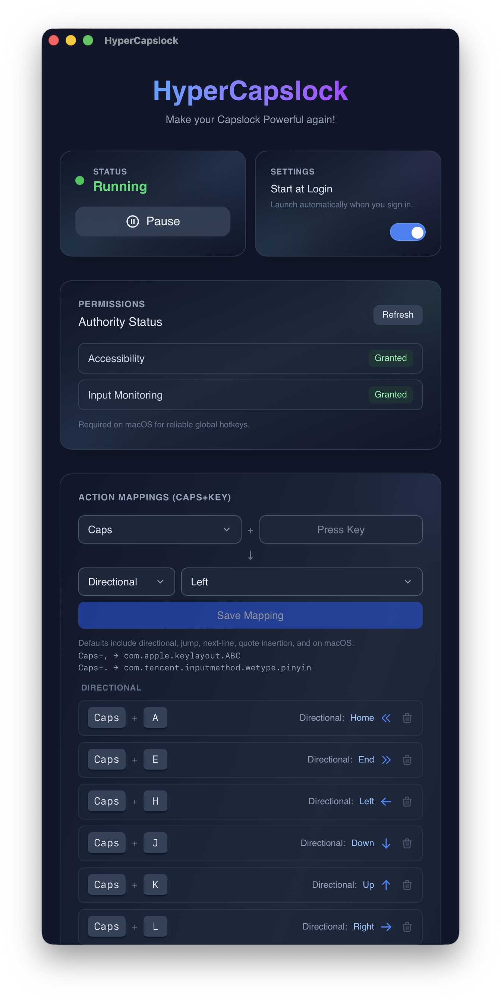

# HyperCapslock

**HyperCapslock** is a lightweight Windows utility that brings Vim-style navigation (H/J/K/L) to the entire operating system. It allows you to use `CapsLock` + `Key` as shortcuts in any application.

## Features

-   **Global Remapping:** Works in every application (Editors, Browser, Explorer, etc.).
-   **Smart CapsLock Handling:**
    -   If used as a modifier (held down with mapped keys), the CapsLock state (and light) does **not** toggle.
    -   If tapped and released quickly (without pressing other keys), it toggles CapsLock on/off as normal.
-   **Native Performance:** Built with **Rust** and the Windows API for zero-latency interception.
-   **System Tray:** Supports minimizing to tray, pausing the service (Gaming Mode), and starting with Windows.

## Key Mappings

### Basic Navigation
-   `CapsLock` + `H` → **Left Arrow**
-   `CapsLock` + `J` → **Down Arrow**
-   `CapsLock` + `K` → **Up Arrow**
-   `CapsLock` + `L` → **Right Arrow**

### Extended Navigation
-   `CapsLock` + `P` → **Next Word** (Ctrl + Right)
-   `CapsLock` + `Y` → **Previous Word** (Ctrl + Left)
-   `CapsLock` + `A` → **Home** (Start of line)
-   `CapsLock` + `E` → **End** (End of line)
-   `CapsLock` + `U` → **Up 10x** (Fast Scroll Up)
-   `CapsLock` + `D` → **Down 10x** (Fast Scroll Down)

### Editing Shortcuts
-   `CapsLock` + `I` → **Backspace**
-   `CapsLock` + `O` → **New Line** (End + Enter)
-   `CapsLock` + `N` → **Docstring Snippet** (Inserts `""""""` and centers cursor)

### Shell Mappings
-   `CapsLock` + `Shift` + `[Key]` → **Execute Shell Command**
    -   User configurable via the UI.
    -   Example: `CapsLock` + `Shift` + `C` → `calc.exe`

## Screenshots



## Architecture

This project is a hybrid application built with [Tauri](https://tauri.app/):

1.  **Frontend (React + TypeScript):**
    -   Displays the application status ("Running") and instructions.
    -   Communicates with the backend via Tauri commands.

2.  **Backend (Rust):**
    -   Uses the `windows` crate to access the Win32 API.
    -   Installs a **Low-Level Keyboard Hook** (`WH_KEYBOARD_LL`) via `SetWindowsHookEx`.
    -   Intercepts keystrokes at the system level to perform remapping before they reach other applications.
    -   Runs in a dedicated background thread to ensure responsiveness.

For a deep dive into the technical implementation, see [how_does_it_work.md](how_does_it_work.md).

## Prerequisites

-   **Windows 10/11**
-   **Node.js** (v16+)
-   **Rust** (latest stable)

## Development Setup

1.  **Clone the repository:**
    ```bash
    git clone https://github.com/XueshiQiao/HyperCapslock.git
    cd HyperCapslock
    ```

2.  **Install dependencies:**
    ```bash
    npm install
    ```

3.  **Run in development mode:**
    ```bash
    npm run tauri dev
    # or
    pnpm tauri dev
    ```
    This will start the React frontend and the Rust backend.

## Building for Production

To create a standalone executable (`.exe`):

```bash
npm run tauri build
```

The output file will be located at:
`src-tauri/target/release/tauri-app.exe`

## Usage Note

**Privilege Levels:**
On Windows, applications running with lower privileges cannot intercept keys from applications running with higher privileges (Administrator).
-   If you want this tool to work inside Task Manager, Admin Powershell, or other Admin-level apps, you must run `tauri-app.exe` as **Administrator**.

## License

This project is licensed under the **GNU General Public License v3.0**. See the [LICENSE](LICENSE) file for details.
