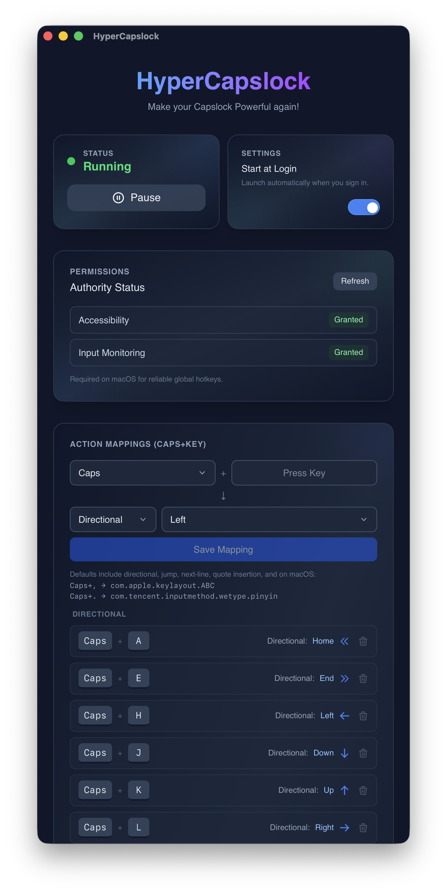

# HyperCapslock

Turn your Caps Lock into a system-wide vim-style navigation layer — without losing the original Caps Lock function.

## The Idea

Caps Lock sits on the home row but does almost nothing. HyperCapslock remaps it to **F18** (a key that doesn't physically exist on any keyboard), then intercepts F18 + other key combos at the OS level to simulate navigation, editing, input switching, and shell commands.

Because F18 isn't a real modifier (not Cmd, Ctrl, Shift, or Alt), **it stacks with all of them for free**:

| Combo | Action |
|-------|--------|
| `Caps + H` | ← Move left |
| `Caps + Shift + H` | ← Select left |
| `Caps + Alt + H` | ← Move left one word |
| `Caps + Shift + Alt + H` | ← Select left one word |

No extra configuration. System modifiers pass through naturally.

If you just **tap** Caps Lock and release without pressing anything else, it still toggles Caps Lock on/off as normal.

## Default Key Mappings

All mappings are customizable through the GUI. These are the defaults:

### Navigation (vim-style)

| Combo | Action |
|-------|--------|
| `Caps + H / J / K / L` | ← ↓ ↑ → Arrow keys |
| `Caps + A` | Home (start of line) |
| `Caps + E` | End (end of line) |
| `Caps + Y` | Previous word |
| `Caps + P` | Next word |
| `Caps + U` | Up 10 lines |
| `Caps + D` | Down 10 lines |

### Editing

| Combo | Action |
|-------|--------|
| `Caps + I` | Backspace |
| `Caps + O` | New line below (End + Enter) |
| `Caps + N` | Insert `""""""` with cursor centered |

### Input Source Switching (macOS)

| Combo | Action |
|-------|--------|
| `Caps + ,` | Switch to ABC (English) |
| `Caps + .` | Switch to Chinese input |

### Shell Commands

`Caps + Shift + [Key]` can be bound to run arbitrary shell commands via the GUI.

## Install (macOS)

### Homebrew

```bash
brew install --cask XueshiQiao/tap/hypercapslock
```

Or download the `.dmg` from [GitHub Releases](https://github.com/XueshiQiao/HyperCapslock/releases).

### Permissions

The app needs **Accessibility** and **Input Monitoring** permissions:
`System Settings → Privacy & Security → Accessibility / Input Monitoring`

## Screenshot

<div align="center">
  
</div>

## Why Not Karabiner-Elements?

[Karabiner-Elements](https://github.com/pqrs-org/Karabiner-Elements) is a powerful tool with 21k+ stars, and I used it for years. But for the specific use case of "Caps Lock as a navigation layer":

- **Config complexity** — Karabiner requires hand-editing JSON for non-trivial remaps. HyperCapslock has a point-and-click GUI.
- **Footprint** — Karabiner installs a kernel extension and multiple background processes. HyperCapslock is a single lightweight native macOS app.
- **The modifier problem** — Karabiner typically maps Caps Lock to a real modifier combo (e.g., Ctrl+Shift+Cmd+Opt). This "hyper key" approach works but can conflict with existing shortcuts. HyperCapslock maps to F18, which conflicts with nothing and naturally stacks with real modifiers.

If you need Karabiner's full power (per-app rules, mouse remapping, device-specific profiles), use Karabiner. If you mainly want vim navigation everywhere with minimal setup, this might be a simpler path.

## How It Works

CapsLock is remapped to F18 via `hidutil` at the OS level. The app then installs a `CGEventTap` at the HID level — a system-wide event tap that intercepts key events before any application sees them.

When F18 is held and another key is pressed, the app swallows the original event and injects the remapped key (e.g., arrow key) into the system input stream. Injected events carry a flag to prevent feedback loops.

State tracking uses lock-protected runtime state (`OSAllocatedUnfairLock` / `NSLock`) for thread safety between the tap thread, timer threads, and the UI. The hook callback does minimal work — integer comparisons and early returns — to avoid introducing input lag.

For the full technical deep-dive, see [how_does_it_work.md](how_does_it_work.md).

## Tech Stack

- **Native macOS** — SwiftUI + AppKit, Swift 5 language mode, macOS 14+
- CoreGraphics `CGEventTap` + `hidutil` for the F18 remap; IOKit for CapsLock state; Carbon TIS for input-source switching
- [Sparkle](https://sparkle-project.org) for auto-update, [Yams](https://github.com/jpsim/Yams) for YAML config
- Single lightweight native process

## Development

### Prerequisites

- macOS 14+
- Xcode 16+
- [XcodeGen](https://github.com/yonaskolb/XcodeGen) (`brew install xcodegen`)

### Setup

```bash
git clone https://github.com/XueshiQiao/HyperCapslock.git
cd HyperCapslock
brew install xcodegen
xcodegen generate
open HyperCapslock.xcodeproj   # Cmd+R to build & run
```

`project.yml` is the source of truth for the Xcode project; run `xcodegen generate` after changing it.

### Build

```bash
xcodebuild -project HyperCapslock.xcodeproj -scheme HyperCapslock -configuration Release build
```

## Troubleshooting

- **Hotkeys stop working**: Logs are written to `/tmp/hypercapslock-macos.log`. Try removing and re-adding the app in Accessibility permissions, then relaunch.
- **Gaming Mode**: Pause/resume via the menu bar icon to temporarily disable all remapping.

## License

GPL v3.0 — see [LICENSE](LICENSE).
