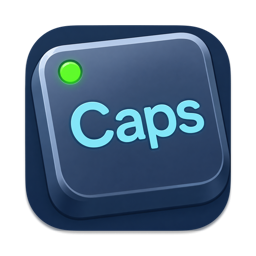
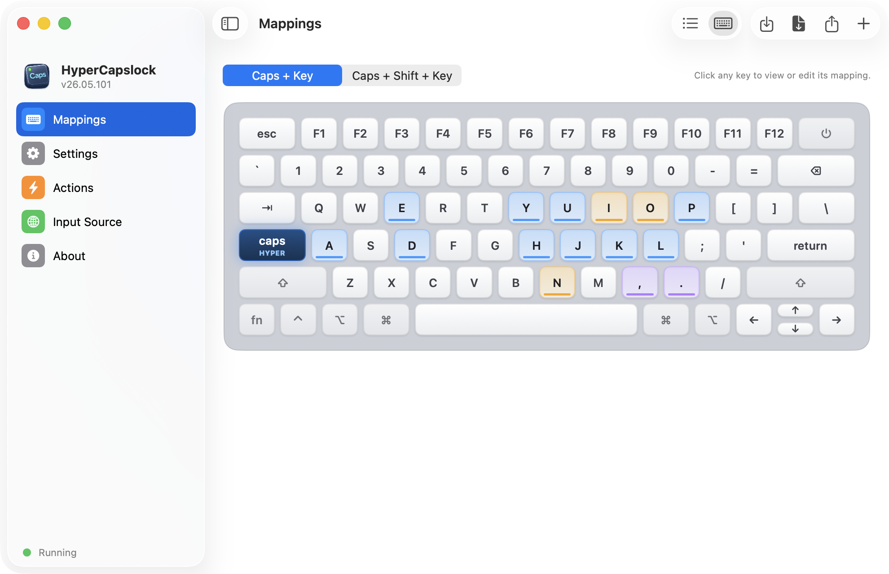
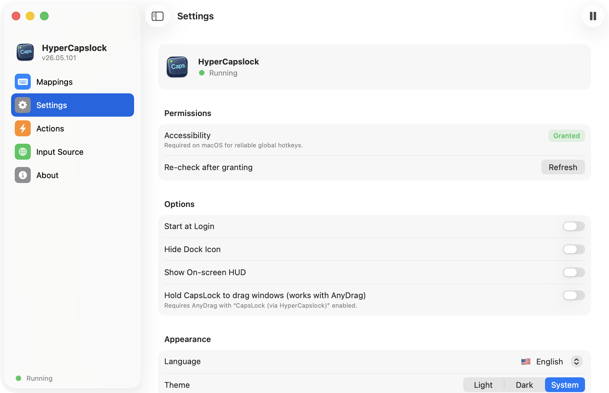
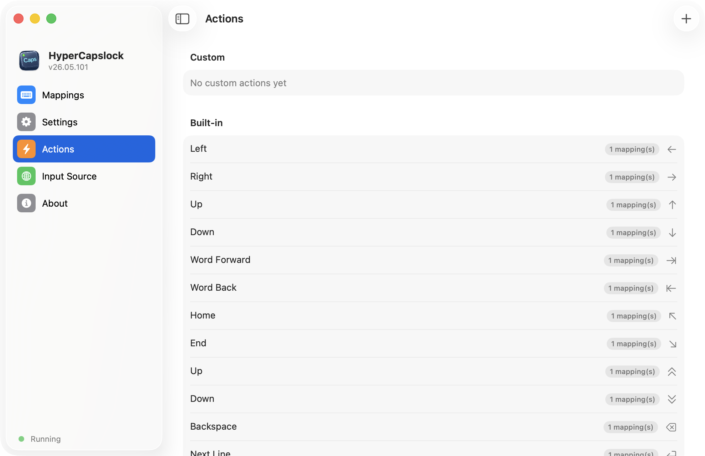
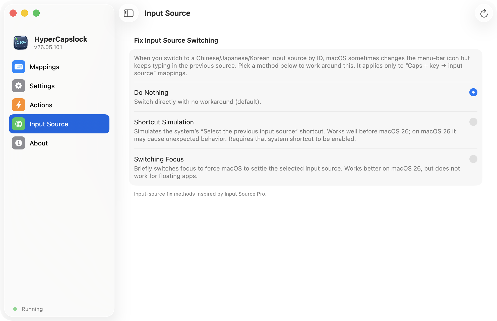
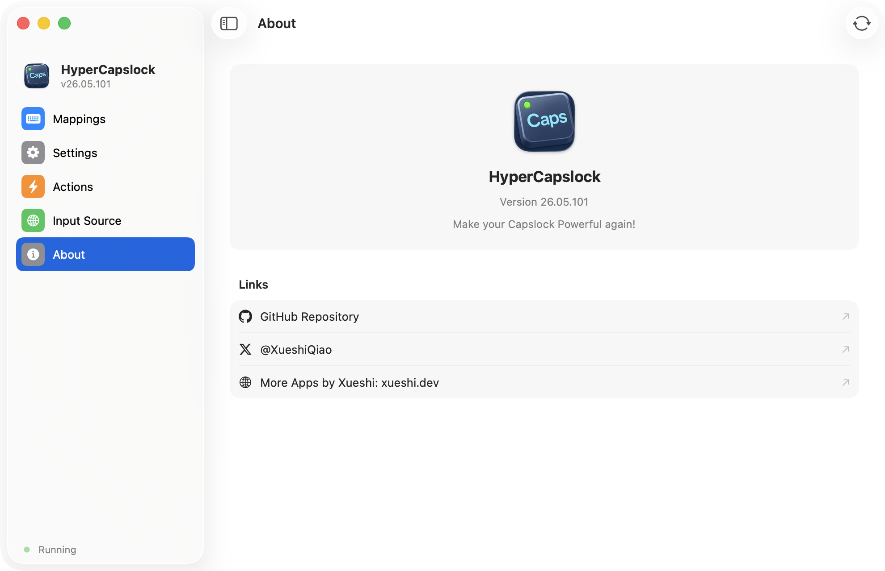

<h1 align="center">
  <br/>
  HyperCapslock
</h1>

<p align="center">
  <b>Caps Lock を、本来の大文字ロック機能はそのままに、システム全体で使える vim 風のナビゲーション＆編集レイヤーに変えるアプリ。</b>
</p>

<p align="center">
  <a href="README.md">🇺🇸 English</a> •
  <a href="README_CN.md">🇨🇳 中文</a> •
  <b>🇯🇵 日本語</b> •
  <a href="README_DE.md">🇩🇪 Deutsch</a>
</p>

<p align="center">
  <a href="https://github.com/XueshiQiao/HyperCapslock/actions/workflows/build.yml"></a>
  <a href="https://github.com/XueshiQiao/HyperCapslock/releases/latest"></a>
  <a href="LICENSE"></a>
  
  <a href="https://github.com/XueshiQiao/HyperCapslock/stargazers"></a>
</p>

<p align="center">
  ⭐ <b>HyperCapslock が役に立ったら、ぜひ <a href="https://github.com/XueshiQiao/HyperCapslock">スター</a>を</b> —— 他の人が見つけやすくなります。
</p>

## コンセプト

Caps Lock はホームポジションのすぐそばにありながら、ほとんど使われていません。HyperCapslock はこれを **F18**（どのキーボードにも物理的に存在しないキー）にリマップし、OS レベルで F18 + 他キーの組み合わせをインターセプトして、ナビゲーション・編集・入力ソース切り替え・キーコンボ・シェルコマンドを実現します。

F18 は本物の修飾キー（Cmd・Ctrl・Shift・Alt）ではないため、**それらと自由に重ねて使え、独自の組み合わせを消費しません**。

たとえば `Caps + H` を `←` キーに割り当てると、次の 4 つの動作が自然に手に入ります。

| 組み合わせ | 動作 |
|-----------|------|
| `Caps + H` | ← 左へ移動 |
| `Caps + Shift + H` | ← 左へ選択 |
| `Caps + Alt + H` | ← 単語単位で左へ移動 |
| `Caps + Shift + Alt + H` | ← 単語単位で左へ選択 |

追加設定は不要です。システムの修飾キーはそのまま透過します。

そして、何も押さずに Caps Lock を**ポンと一度だけ押して**離せば、これまでどおり Caps Lock のオン／オフが切り替わります。

## ✨ 機能一覧

以下は現行バージョンがサポートする機能の全リストです。すべて GUI から設定でき、設定ファイルを手で編集する必要はありません。

### 🎹 トリガー（Triggers）

1 つの「マッピング」は、**トリガー**と**アクション**の組み合わせです。サポートされるトリガーは次のとおりです。

| トリガー | 説明 |
|---------|------|
| **Caps + キー** | Caps（F18）を押しながらキーを押す（例：`Caps + H`） |
| **Caps + Shift + キー** | Shift を伴う独立したマッピング。Shift なし版とは別のアクションを割り当てられる |
| **Caps シングルタップ（Caps×1）** | Caps を 1 回だけ叩くと発動（既定の Caps Lock 切り替えの代わり） |
| **Caps ダブルタップ（Caps×2）** | Caps を素早く 2 回叩くと発動。シングルタップの挙動には影響しない |
| **修飾キーのダブルタップ** | 修飾キーを素早く 2 回叩くと発動。左右を区別可能：⌘ / ⌃ / ⌥ / ⇧ / Fn |

> 「Caps シングルタップ」にアクションを割り当てた場合でも、任意のキーを組み込みの「Toggle Caps Lock」アクションに割り当てれば、本来の Caps Lock 切り替えを残せます。

### ⚡ アクション（Actions）

トリガーには、次のいずれかのアクションを割り当てられます。

| アクション | できること |
|-----------|-----------|
| **カーソル移動** | 上 / 下 / 左 / 右、前後の単語、行頭（Home）、行末（End） |
| **N 行ジャンプ** | 上または下へ任意の行数を一気に移動（例：10 行下へ）。行数は変更可能 |
| **Backspace / 改行 / 引用符の挿入** | Backspace、下に新しい行を作る（行末 + Return）、引用符のペアを挿入してカーソルを中央に置く |
| **入力ソースの切り替え** | 指定した入力ソース（ABC、WeChat 拼音、日本語 IME など）へ直接切り替え。ピッカーから選択 |
| **Key Combo** | 任意のシステムショートカットを合成（例：`Cmd+Shift+V`、`Cmd+Ctrl+Space`） |
| **シェルコマンドの実行** | 任意のシェルコマンドを実行（例：`open -a Calculator`、スクリプトの起動など） |
| **アプリを開く / 切り替える** | 指定したアプリケーションを起動して前面に出す |
| **Hold Modifier** | トリガーを押している間ずっと修飾キーを押し続け、離すと解放する——push-to-talk 系アプリ向け |
| **Toggle Caps Lock** | システムの Caps Lock を明示的に切り替える（本来の Caps Lock 機能を残すため） |
| **何もしない（Do Nothing）** | キーを握りつぶして何もしない——特定アプリでキーを「無効化」するのに便利 |

**カーソル移動**と **Backspace** は、実際に押している Shift / Option などの修飾キーをそのまま透過します。そのため `Caps + Shift + H` で選択、`Caps + Option + H` で単語単位の移動が、すべて設定なしで使えます。（入力ソースの切り替え・Key Combo・コマンド実行・アプリを開く・Hold Modifier は、それぞれ固有の修飾キーの意図を持つため、この透過の対象外です。）

### 🎯 アプリ別ルール（Per-App Rules）

旧バージョンからの最大の追加機能です。**同じトリガーでも、アプリごとに違うアクションを実行できます。**

- 任意のマッピングに「アプリ別ルール」を追加します。**最前面のアプリ**が指定したアプリ一覧に一致すればルールのアクションが、そうでなければ既定のアクションが実行されます。
- ルールは順番に評価され、最初に一致したものが採用されます。優先順位は並べ替え可能です。
- アプリは `/Applications` からアプリピッカーで選ぶだけ。bundle id を手入力する必要はありません。
- 典型的な使い方：あるアプリだけ `Caps + J` を別の機能に変える、または「何もしない」を使って特定アプリでキーを完全に無効化する。

### 🧩 カスタムアクション（Custom Actions）

- 組み込みアクションに加えて、**名前付きのカスタムアクション**（例：「20 行下へジャンプ」「電卓を開く」「右 Option を押し続ける」）を作成し、ライブラリに保存できます。
- 1 つのカスタムアクションは複数のマッピングで再利用できます。1 か所を編集すれば、それを参照するすべてのマッピングに反映されます。
- 組み込みアクションとカスタムアクションは並べて表示され、「N 件のマッピングで使用中」と表示されます。削除時にはまだ参照されているか警告します。

### 🖥️ 画面オーバーレイ（HUD）

- アクション発動時に、画面下部に HUD が表示され、「トリガー → アクション」を一目で示します（例：`Caps + J → ↓`）。
- 設定でオン／オフを切り替えられ、表示時間も調整できます（300〜6000 ミリ秒、既定は 1350 ミリ秒）。
- **Hold Modifier** 系のアクションでは、HUD はキーを離すまで**表示されたまま**になり、push-to-talk が効いているかを確認できます。

### ⌨️ 入力ソースの切り替えと CJKV の不具合対策

- 「入力ソースの切り替え」アクションは、指定した入力ソースへ直接ジャンプします。
- 中国語 / 日本語 / 韓国語 / ベトナム語（CJKV）の IME へ `TISSelectInputSource` で切り替えると、「メニューバーのアイコンは変わるのに入力は前のソースのまま」という長年の問題があります。これに対し、「入力ソース」ページで 3 つの対策を選べます。
  - **なし**（既定。通常の切り替え）
  - **ショートカットのシミュレーション**（システムの「前の入力ソースを選択」ショートカットを模倣）
  - **フォーカスの切り替え**（一瞬だけウィンドウフォーカスを切り替えて強制的に反映。フローティング／アクティブ化できないウィンドウでは効かないことがある）
- この対策は「Caps + キー → 入力ソース」のマッピングにのみ適用されます。

### 🛠️ その他

- **メニューバー操作**：一時停止 / 再開（Gaming Mode——すべてのリマップを一時的に無効化）、アップデートの確認、More Apps、設定を開く、終了。
- **設定のインポート / エクスポート**：完全に自己完結した `.yml` 設定をワンクリックで書き出し、またはファイルから読み込み。
- **自動アップデート**：[Sparkle](https://sparkle-project.org) を内蔵。バックグラウンドでの確認も手動確認も可能。
- **ログイン時に起動**：`SMAppService` によりログイン時に自動起動。
- **Dock アイコンを隠す**：メニューバー常駐のみで動作させられる。
- **テーマ**：ライト / ダーク / システムに従う。
- **多言語 UI**：English / 中文 / 日本語 / Deutsch。
- **設定の互換性**：YAML 形式は以前の Tauri 版とバイト単位で互換性があり、既存の `action_mappings.yml` / `app_config.yml` はそのまま読み込めます。新しいバージョンが書き込んだ未知のキーも、古いビルドでの保存時に欠落なく保持されます。

## デフォルトのキーマッピング

以下はインストール直後のデフォルトです。**すべて GUI でカスタマイズできます。**

### ナビゲーション（vim 風）

| 組み合わせ | 動作 |
|-----------|------|
| `Caps + H / J / K / L` | ← ↓ ↑ → 矢印キー |
| `Caps + A` | Home（行頭） |
| `Caps + E` | End（行末） |
| `Caps + Y` | 前の単語 |
| `Caps + P` | 次の単語 |
| `Caps + U` | 10 行上へジャンプ |
| `Caps + D` | 10 行下へジャンプ |

### 編集

| 組み合わせ | 動作 |
|-----------|------|
| `Caps + I` | Backspace |
| `Caps + O` | 下に新しい行を作る（行末 + Return） |
| `Caps + N` | 引用符のペアを挿入してカーソルを中央に置く |

### 入力ソースの切り替え

| 組み合わせ | 動作 |
|-----------|------|
| `Caps + ,` | ABC（英語）へ切り替え |
| `Caps + .` | WeChat 拼音へ切り替え |

> これらはあくまでデフォルトです。キーの追加・削除・割り当て変更ができ、任意のキーを上記「アクション」のいずれにも割り当てられます。

## インストール（macOS）

### Homebrew

```bash
brew install --cask XueshiQiao/tap/hypercapslock
```

または [GitHub Releases](https://github.com/XueshiQiao/HyperCapslock/releases) から `.dmg` をダウンロードしてください。

### 権限

キーボードイベントの tap を仕掛けるため、**アクセシビリティ（Accessibility）** 権限が必要です。
`システム設定 → プライバシーとセキュリティ → アクセシビリティ`

（「入力監視」は不要です——あれは `.listenOnly` の tap 専用です。本アプリはアクティブな `.defaultTap` を使うため、macOS はアクセシビリティ権限のみを要求します。）

## スクリーンショット

<div align="center">
  
</div>

<table align="center">
  <tr>
    <td width="50%"></td>
    <td width="50%"></td>
  </tr>
  <tr>
    <td width="50%"></td>
    <td width="50%"></td>
  </tr>
</table>

## なぜ Karabiner-Elements ではないのか？

[Karabiner-Elements](https://github.com/pqrs-org/Karabiner-Elements) は 21k+ のスターを持つ強力なツールで、私自身も長年使ってきました。ただし「Caps Lock をナビゲーションレイヤーにする」という具体的な用途に限れば——

- **設定の複雑さ** —— Karabiner は少し凝ったリマップになると JSON の手編集が必要です。HyperCapslock は GUI から手軽に設定でき、さらにアプリ別ルールやカスタムアクションのライブラリなども備えています。
- **フットプリント** —— Karabiner はカーネル拡張と複数のバックグラウンドプロセスをインストールします。HyperCapslock は単一の軽量なネイティブ macOS アプリです。
- **修飾キーの問題** —— Karabiner はたいてい Caps Lock を本物の修飾キーの組み合わせ（例：Ctrl+Shift+Cmd+Opt）に割り当てます。この「hyper key」方式は機能しますが、既存のショートカットと衝突することがあります。HyperCapslock は F18 に割り当てるため、何とも衝突せず、本物の修飾キーと自然に重なります。

Karabiner のフル機能（マウスのリマップ、デバイスごとのプロファイルなど）が必要なら Karabiner を使ってください。ほぼ設定なしで、どこでも vim 風のナビゲーションと編集を使いたいだけなら、こちらのほうが手軽かもしれません。

## 仕組み

Caps Lock は OS レベルで `hidutil` により F18 へリマップされます。続いてアプリは HID レベルに `CGEventTap` を仕掛けます——これは、キーイベントが他のどのアプリに届くより前に横取りする、システム全体のイベント tap です。

F18 を押しながら別のキーが押されると、アプリは元のイベントを握りつぶし、リマップ後のキー（例：矢印キー）をシステムの入力ストリームに注入します。注入されたイベントにはフラグが付き、フィードバックループを防ぎます。

状態管理にはロックで保護したランタイム状態（`OSAllocatedUnfairLock` / `NSLock`）を使い、tap スレッド・タイマースレッド・UI の間のスレッド安全性を確保します。フックのコールバックは最小限の処理——整数比較と早期 return——しか行わず、入力遅延を生まないようにしています。

技術的な詳細は [how_does_it_work.md](how_does_it_work.md) を参照してください。

## 技術スタック

- **ネイティブ macOS** —— SwiftUI + AppKit、Swift 5 言語モード、macOS 14+
- F18 リマップに CoreGraphics `CGEventTap` + `hidutil`、CapsLock 状態の取得に IOKit、入力ソース切り替えに Carbon TIS
- 自動アップデートに [Sparkle](https://sparkle-project.org)、YAML 設定に [Yams](https://github.com/jpsim/Yams)
- 単一・軽量なネイティブプロセス

## 開発

### 必要なもの

- macOS 14+
- Xcode 16+
- [XcodeGen](https://github.com/yonaskolb/XcodeGen)（`brew install xcodegen`）

### セットアップ

```bash
git clone https://github.com/XueshiQiao/HyperCapslock.git
cd HyperCapslock
brew install xcodegen
xcodegen generate
open HyperCapslock.xcodeproj   # Cmd+R でビルド＆実行
```

`project.yml` が Xcode プロジェクト設定の信頼できる唯一の情報源（single source of truth）です。変更したら `xcodegen generate` を実行してください。

### ビルド

```bash
xcodebuild -project HyperCapslock.xcodeproj -scheme HyperCapslock -configuration Release build
```

## トラブルシューティング

- **ホットキーが効かなくなった**：ログは `/tmp/hypercapslock-macos.log` に出力されます。アクセシビリティ権限から本アプリを一度削除して再追加し、アプリを再起動してみてください。
- **Gaming Mode**：メニューバーのアイコンから一時停止／再開すると、すべてのリマップを一時的に無効化できます。
- **中国語／日本語の入力切り替えが反映されない**：「入力ソース」ページで「ショートカットのシミュレーション」または「フォーカスの切り替え」対策を試してください。

## ライセンス

GPL v3.0 —— [LICENSE](LICENSE) を参照してください。
