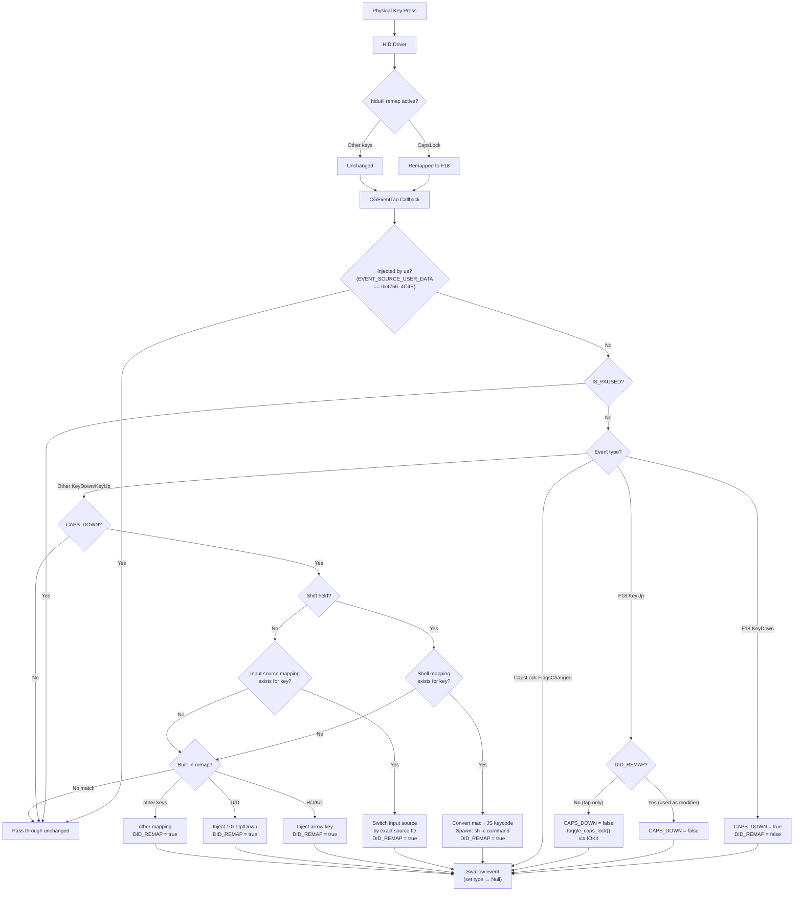
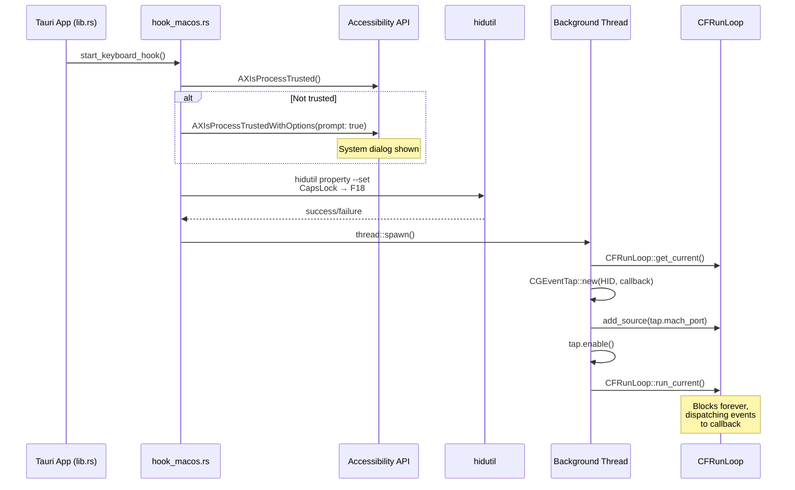
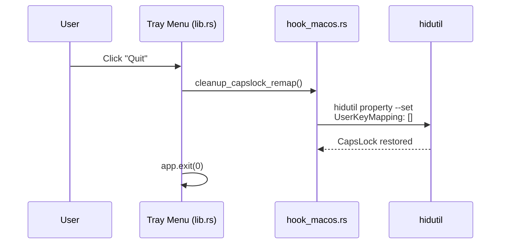

# macOS Implementation Notes

This document covers the macOS keyboard hook implementation in `src-tauri/src/hook_macos.rs`, including the architectural decisions, platform challenges, and solutions.

## Architecture Overview

The macOS hook uses **CGEventTap** (from the `core-graphics 0.24` crate) to intercept keyboard events system-wide. The event tap runs on a dedicated background thread with its own `CFRunLoop`.

### Event Pipeline



### Startup Sequence



### Shutdown Sequence



### Key Components

| Component | Purpose |
|-----------|---------|
| `core-graphics 0.24` | CGEventTap, CGEvent creation, event posting |
| `core-foundation 0.10` | CFRunLoop for the event tap thread |
| `hidutil` | HID-level CapsLock → F18 remap |
| Carbon Text Input Source APIs | Input source switching by exact source ID (`TIS*`) |
| IOKit FFI | Hardware CapsLock toggle for tap-only behavior |
| Accessibility API | Permission check via `AXIsProcessTrusted()` |

## The CapsLock Problem

macOS treats CapsLock as a **toggle key**, not a hold key. This creates several challenges:

### What doesn't work

1. **`FlagsChanged` events** — macOS fires only ONE `FlagsChanged` event per CapsLock press-release cycle. There are no separate press and release events. This makes it impossible to detect "CapsLock held down" vs "CapsLock released".

2. **`CGEventFlagAlphaShift`** — This flag reflects the CapsLock **toggle state** (on/off), not the physical key state (pressed/released). It flips once per press-release cycle.

3. **`CGEventSourceKeyState`** — Polling `CGEventSourceKeyState(CombinedSession, 0x39)` also returns the **toggle state**, not the physical state. Returns `false` when the key is physically pressed and `true` when released (inverted from what you'd expect for a "held" check).

### The Solution: hidutil + F18

We use `hidutil` to remap CapsLock to F18 at the **HID driver level**, before events reach the CGEventTap. F18 is a standard key that generates proper `KeyDown` and `KeyUp` events.

```
hidutil property --set '{"UserKeyMapping":[{
  "HIDKeyboardModifierMappingSrc": 0x700000039,
  "HIDKeyboardModifierMappingDst": 0x70000006D
}]}'
```

- `0x700000039` = CapsLock (USB HID usage code)
- `0x70000006D` = F18 (USB HID usage code)

This remap is applied on app startup (`setup_capslock_remap()`) and removed on app quit (`cleanup_capslock_remap()`). The cleanup runs in the tray "Quit" handler in `lib.rs`.

To restore the original mapping:
```
hidutil property --set '{"UserKeyMapping":[]}'
```

### CapsLock Tap-Only Toggle

When CapsLock is pressed and released without any other key being pressed (tap-only), we want to toggle the actual CapsLock state. However, **injecting a CapsLock key event via CGEvent does not toggle the hardware CapsLock state** — macOS ignores synthetic CapsLock events for the LED and modifier state.

The solution is to use **IOKit** directly:

```rust
fn toggle_caps_lock() {
    // Opens IOHIDSystem service
    // Reads current state via IOHIDGetModifierLockState
    // Writes inverted state via IOHIDSetModifierLockState
}
```

This toggles the actual hardware CapsLock LED and modifier state.

## Event Tap Details

### Setup

```rust
CGEventTap::new(
    CGEventTapLocation::HID,           // Hardware level
    CGEventTapPlacement::HeadInsertEventTap,
    CGEventTapOptions::Default,        // Active tap (can modify events)
    vec![KeyDown, KeyUp, FlagsChanged],
    callback,
)
```

### Preventing Feedback Loops

Every injected event is stamped with a magic value:

```rust
const INJECTED_EVENT_MAGIC: i64 = 0x4756_4C4E; // "GVLN"

event.set_integer_value_field(
    EventField::EVENT_SOURCE_USER_DATA,
    INJECTED_EVENT_MAGIC,
);
```

The callback checks this field and skips any event with the magic value.

### Swallowing Events

To suppress/swallow an event (prevent it from reaching the application):

```rust
event.set_type(CGEventType::Null);
return None;
```

The callback returns `Option<CGEvent>`:
- `None` = keep the original event unchanged (pass-through)
- Setting `event.set_type(Null)` before returning `None` = swallow the event

### TapDisabledByTimeout

macOS automatically disables an event tap if the callback takes too long. The callback handles this by simply returning `None` when it receives `TapDisabledByTimeout` or `TapDisabledByUserInput`, which re-enables the tap.

### core-graphics 0.24 Caveats

- **`CGEventType` does NOT implement `PartialEq`** — comparison must be done via `(a as u32) == (b as u32)`
- **Callback return type is `Option<CGEvent>`** — there is no `CallbackResult` enum
- **`CGEventSource::new(CGEventSourceStateID::Private)`** — use `Private` to avoid contaminating the system event state

## Key Mapping Differences (Windows vs macOS)

| Action | Windows | macOS |
|--------|---------|-------|
| Arrow keys (H/J/K/L) | VK_LEFT/DOWN/UP/RIGHT | KC_LEFT/DOWN/UP/RIGHT |
| Backspace (I) | VK_BACK | KC_DELETE (0x33) |
| Word Forward (P) | Ctrl+Right | **Option+Right** |
| Word Back (Y) | Ctrl+Left | **Option+Left** |
| Home / Start of line (A) | Home key | **Cmd+Left** |
| End of line (E) | End key | **Cmd+Right** |
| New Line (O) | End, Enter | **Cmd+Right, Enter** |
| Fast Scroll Up (U) | 10x Up | 10x Up |
| Fast Scroll Down (D) | 10x Down | 10x Down |
| Snippet quotes (N) | SendInput unicode | CGEvent set_string |

macOS uses `Option` (Alt) for word navigation and `Cmd` for line navigation, matching standard macOS text editing conventions.

## Shell Mappings

Shell mappings are stored as **JavaScript keyCodes** (u16) in the shared `SHELL_MAPPINGS` global. On macOS, the CGEventTap receives **macOS keycodes**, which must be converted to JS keyCodes via `mac_keycode_to_js_keycode()`.

Shell commands are executed with `sh -c` on macOS (vs `cmd /C` on Windows).

## Input Source Mappings (macOS)

Input-source mappings are stored as **JavaScript keyCodes** (u16) mapped to exact macOS input source IDs in `INPUT_SOURCE_MAPPINGS`.

- Trigger: `Caps + Key` (non-shift path), checked before built-in remaps.
- Behavior: if mapping exists, the event is swallowed and the app attempts to switch input source via native Text Input Source APIs (`TISCreateInputSourceList` + `TISSelectInputSource`).
- Failure mode: non-blocking. The key event is still consumed, and a warning is logged.
- Built-in remap keys remain reserved and are not overridden by input-source mappings.

Persistence file: `input_source_mappings.json` (app data directory).

Default mappings are seeded on first load:
- `188` (`,`) → `com.apple.keylayout.ABC`
- `190` (`.`) → `com.tencent.inputmethod.wetype.pinyin`

Additional keycode notes in `mac_keycode_to_js_keycode()`:
- mac keycode `0x2B` → JS keycode `188` (comma)
- mac keycode `0x2F` → JS keycode `190` (period)

## Accessibility Permission

CGEventTap requires **Accessibility permission** in System Settings > Privacy & Security > Accessibility. On startup:

1. `AXIsProcessTrusted()` checks if permission is granted
2. If not, `AXIsProcessTrustedWithOptions(kAXTrustedCheckOptionPrompt: true)` shows the system prompt
3. If the tap fails to create, an error is logged

The user must grant permission and may need to restart the app for it to take effect.

## Conditional Compilation

Platform-specific code is gated in `lib.rs`:

```rust
#[cfg(target_os = "windows")]
mod hook_windows;
#[cfg(target_os = "macos")]
mod hook_macos;
```

Shared state (`CAPS_DOWN`, `DID_REMAP`, `IS_PAUSED`, `SHELL_MAPPINGS`, `INPUT_SOURCE_MAPPINGS`) lives in `lib.rs` and is imported by both platform modules via `use crate::*`.

## Dependencies

In `Cargo.toml`:

```toml
[target.'cfg(target_os = "macos")'.dependencies]
core-graphics = "0.24"
core-foundation = "0.10"
```

The `windows` crate is gated to `cfg(target_os = "windows")`.
